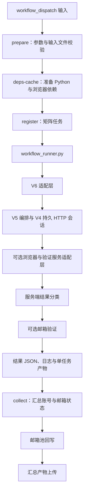

# V6 项目完整静态审查

审查日期：2026-09-19。仓库：`D:\Project\GitHub_Project\new_github`。基准提交：`6c53f2d`（新增 EzCaptcha 求解选项）。

本报告覆盖 V6 工作流、共享入口与模块依赖、配置、持久状态、邮箱与结果管理、网络计量、缓存、凭证安全及测试边界。验证码服务仅作为外部依赖分析，不提供规避验证码或平台反滥用机制的改进方案。

本次没有发送注册、登录、验证码服务或邮箱读取请求，没有修改、移动、删除业务文件，没有推送。除本报告外不新增项目文件。以下区分代码事实、离线验证和需要运行数据才能确认的风险。

## 1. 主要结论

V6 不是一套独立重写的程序。它在 V5 编排上替换邮箱凭证格式、邮箱验证入口和部分结果分类，底层继续调用 V4、V3 及更早的公共辅助代码。不能根据文件名中的版本号或 `manual` 判定文件无用。

工程已具备统一入口、参数预检、持久状态、阶段诊断、部分脱敏、缓存清理和回归测试，但这些机制尚未形成一致的安全与结果契约。当前最应该优先处理的是：

1. **凭证保护**：账号密码和邮箱完整凭证进入控制台、Git 跟踪文件和运行产物；邮箱备用读取路径会向第三方服务发送刷新令牌。
2. **结果保全**：账号创建结果与邮箱验证耦合，某些中断会导致已创建账号未进入汇总；邮箱池提交失败又可能阻止汇总上传。
3. **状态真实性**：字符串退出码被转成成功、`login` 表单被推断为已注册、跳过验证被包装成 `ok=True`，使绿色 Job 与业务成功不是一回事。
4. **可维护性**：V6 通过修改 V5 全局对象实现复用，工作流与本地 CLI 默认值不同，依赖与浏览器缓存缺乏严格版本约束。

本次 102 项离线测试通过；22 个内部模块编译检查通过；6 个工作流 YAML 解析通过。这些结果证明现有检查能够通过，**不证明所有浏览器、服务商、网络与邮箱组合均经过真实验证**。

## 2. 项目边界与目录职责

与 V6 有关的目录结构如下，省略凭证内容、运行数据和历史备份内部文件：

```text
new_github/
├─ workflow_runner.py                     统一工作流入口和兼容加载器
├─ .github/workflows/
│  ├─ register-ruyipage-v6.yml             本次主入口
│  ├─ register-ruyipage-v5.yml             仍启用，复用相同基础模块
│  ├─ email-verify-ruyipage-v3.yml         独立邮箱验证流程
│  ├─ register-funcaptcha-snapshots.yml    采集流程
│  ├─ capture-images.yml                  采集流程
│  └─ Clear_All_Workflow.yml              管理流程
├─ workflow_modules/                      22 个内部 Python 模块
├─ ruyipage_manual_register/              当前仍有共享浏览器辅助依赖
├─ rank_v11/                              本地模型服务与模型资产
├─ yolo/                                  骰子识别相关资产与实现
├─ tests/                                 13 个 test_*.py 文件及 conftest.py
├─ docs/                                  结构、设计与审查文档
├─ v5_desktop_ui/                          本地界面，不是 V6 Actions 入口
├─ backup/                                归档，不属于现行 V6 主调用链
├─ requirements-ruyipage-v5.txt            引入 V4 依赖列表
├─ requirements-ruyipage-v4.txt
├─ requirements.txt                       另有旧入口及模型依赖
├─ country_codes.txt                      国家代码输入校验数据
├─ Email_registing_v6.txt                 V6 邮箱输入，含敏感凭证
├─ IP.txt                                 代理输入，可能含认证信息
├─ oath2_account.v3.txt                   独立验证流程的账号输入
├─ AGENTS.md / Agent.md                   项目维护约定
└─ README*.md                             新旧入口说明
```

代码规模：V6 YAML 为 1,017 行；统一入口为 226 行；`workflow_modules/` 合计 16,675 行。V6 Python 入口只有 185 行，绝大部分功能来自共享模块。

AST 静态 import 追踪得到 18 个从 V6 入口可达的内部模块；工作流还单独调用 `v5_proxy_pool`，因此主工作流涉及至少 19 个内部模块。这里的“可达”包括条件分支中的 import，不能解释成每次执行都会跑到全部功能，也不能覆盖所有动态依赖。

### 2.1 模块职责与实际依赖

下表文件名除另有注明外都位于 `workflow_modules/`。

| 文件 | 行数 | 在 V6 中的职责与影响 |
| --- | ---: | --- |
| `register_ruyipage_v6.py` | 185 | V6 环境映射、凭证桥接、邮箱验证开关、终止结果分类；调用 V5 主流程 |
| `register_ruyipage_v5.py` | 3,019 | 参数、服务选择、流程编排、诊断、最终结果；V6 的主要实现所在 |
| `register_ruyipage_v4.py` | 1,284 | 公共参数、身份生成桥接、代理配置、浏览器与资源辅助 |
| `register_ruyipage_v3.py` | 1,610 | 被继续调用的浏览器与本地模型辅助；不是单纯历史文件 |
| `battle_protocol_flow_v4.py` | 1,088 | HTTP 会话、表单快照、状态转换、响应分类、状态持久化 |
| `v6_email_pool.py` | 206 | 四字段凭证解析、按任务索引分配、输出原行、移除已消费邮箱 |
| `v5_email_pool.py` | 161 | 共享凭证类型；V6 转换后供旧接口使用 |
| `v6_email_verifier.py` | 1,359 | V6 邮箱验证编排、页面状态判断、邮件轮询与最终状态确认 |
| `v5_email_verifier.py` | 1,178 | 公共浏览器缓存、英文配置、登录辅助、邮件读取与备用路径 |
| `o2_email_reader.py` | 255 | 第三方邮件读取客户端，是独立的凭证信任边界 |
| `v5_proxy_pool.py` | 383 | 工作流单独调用的代理输入校验与分配，不在上述 18 个可达模块之内 |
| `proxy_traffic_meter.py` | 754 | 本地代理转发、上游字节计量、直连旁路单独统计 |
| `v4_browser_resource_optimizer.py` | 1,062 | 资源策略、公共静态缓存和相应统计 |
| `v5_resource_policy.py` | 53 | 共享资源策略常量 |
| `v5_cloak_adapter.py` | 315 | 可选浏览器的接口适配 |
| `v5_yescaptcha_solver.py` | 301 | 对应服务的适配模块；其他服务主要集中在 V5 编排文件中 |
| `captcha_image_collector.py` | 318 | 图像采集相关公共依赖 |
| `isolated_proxy_adapter.py` | 307 | 历史公共网络适配依赖，存在于导入链中 |
| `register.py` | 1,513 | 仍被引用的身份生成与旧公共函数，不能直接删除 |
| `ruyipage_manual_register/manual_same_browser_register_ruyipage.py` | 1,264 | 位于内部模块目录之外，但被 V3/V4 实际导入 |

来源：[V6 入口](D:/Project/GitHub_Project/new_github/workflow_modules/register_ruyipage_v6.py:12)、[V4 的共享辅助加载](D:/Project/GitHub_Project/new_github/workflow_modules/register_ruyipage_v4.py:35)。

`rank_v11/` 是条件启用的模型服务，目录内有三份 `.pt` 权重，整个目录约 29.7 MB。`yolo/` 包含另一组骰子相关资产；工作流存在 V11 选项，不代表它会自动组合调用 `yolo/` 的全部能力。此处只检查资产与引用，未加载模型或评估识别率。

## 3. 执行架构



这是职责与结果依赖图，不是对外部平台内部机制的判断。

### 3.1 工作流层

- `prepare`：校验任务数、并发数、国家代码、所选服务凭证、代理文件和邮箱池容量，再生成矩阵索引。
- `deps-cache`：准备 Python 环境和所需浏览器，缓存虚拟环境与浏览器资源。超时为 25 分钟。
- `register`：每个矩阵任务在独立 Runner 上执行，最多三次尝试；部分明确分类的退出码停止重试。每个 Job 超时为 30 分钟，`fail-fast: false`。
- `collect`：下载单任务账号产物，合并结果，回写邮箱池，再上传汇总。

单任务失败不会因 `fail-fast` 自动取消其他任务，但用户取消、Job 超时、Runner 故障和部分依赖步骤失败仍可中止执行。仅凭日志里出现“取消”无法确定是谁触发了终止；需要事件与阶段证据。

### 3.2 统一入口层

`workflow_runner.py` 用自定义加载器，从 `workflow_modules/` 读取实现，但保留旧的顶层模块名，并把模块 `__file__` 设置为虚拟的仓库根路径。

好处是旧代码按 `__file__` 计算资源位置的逻辑得以保留；代价是堆栈中的 `new_github/register_ruyipage_v5.py` 等路径可能不是磁盘上的真实文件，实际源码位于 `workflow_modules/`。直接绕过入口执行内部文件，不能视为受保证的使用方式。

来源：[兼容加载器](D:/Project/GitHub_Project/new_github/workflow_runner.py:48)。

### 3.3 V6 与 V5 的关系

V6 先把部分 `V6_*` 环境变量映射到 `V5_*`，然后替换 V5 的 parser、凭证类型、邮箱验证函数和共享协议类方法，最后调用 `v5.main()`。

这使现有流程容易复用，但共享代码的改动可能同时影响 V5、V6 和独立邮箱验证流程。V6 不是与 V5 完全隔离的实现。当前每个任务运行在独立进程中，降低了全局修改相互污染的概率；若以后在同一个 Python 进程中交替调用 V5/V6，替换状态不会自动还原。

来源：[环境映射](D:/Project/GitHub_Project/new_github/workflow_modules/register_ruyipage_v6.py:26)、[全局契约替换](D:/Project/GitHub_Project/new_github/workflow_modules/register_ruyipage_v6.py:148)。

## 4. 实际配置与容易误解的默认值

### 4.1 GitHub Actions 页面

| 配置 | 当前默认 | 当前约束或注意事项 |
| --- | --- | --- |
| 任务数 `count` | 1 | 1–256；这是任务总数 |
| 最大并发 `max_parallel` | 20 | 1–20，并受到任务总数限制 |
| 国家代码 | USA | 手动输入三字母代码，准备阶段对照 `country_codes.txt` |
| 验证服务 | YesCaptcha | UI 另含本地 V11、CapMonster、2Captcha、SolveCaptcha、EzCaptcha |
| 服务密钥 | 空 | 对应仓库 Secret 优先于手动输入 |
| 是否向外部服务传代理 | 传代理 | 参数仍名为 `capmonster_proxy`，UI 已是泛化描述 |
| 浏览器 | RuyiPage | 可选 CloakBrowser；这个选择针对挑战浏览器 |
| 注册网络 | 直连 | 可选代理；不能因此推断全部外部请求都走同一路线 |
| 代理池文件 | IP.txt | 仅代理模式相关 |
| 邮箱来源 | 待注册邮箱 | 可选自动生成邮箱 |
| 注册后验证邮箱 | 是 | 仅指定邮箱分支执行邮箱读取 |

来源：[工作流输入](D:/Project/GitHub_Project/new_github/.github/workflows/register-ruyipage-v6.yml:6)。

密钥输入框是普通 `workflow_dispatch` 输入，不等同于 Secret 存储。日志中的 `add-mask` 只能处理相应日志显示，不能把事件输入、文件或上传产物自动变成秘密。

### 4.2 工作流和本地 CLI 不是同一套默认值

| 项目 | Actions 实际传入 | 未配置环境变量的共享 CLI 默认 |
| --- | --- | --- |
| 服务 | YesCaptcha | V11 |
| 邮箱来源 | 待注册邮箱 | generated |
| 邮箱池文件 | Email_registing_v6.txt | Email_registing.txt |
| 邮箱索引 | matrix.index，从 1 开始 | 0，进入池模式后会校验失败 |

V6 parser 只更改了邮箱来源参数的帮助文案，没有同时替换邮箱文件参数的默认值。现有测试检查了帮助文案，未检查该默认值。这不会直接破坏已经显式传参的 Actions，但会影响迁移到本地的预期。

来源：[共享 parser 默认](D:/Project/GitHub_Project/new_github/workflow_modules/register_ruyipage_v5.py:356)、[V6 帮助文案适配](D:/Project/GitHub_Project/new_github/workflow_modules/register_ruyipage_v6.py:71)、[现有测试](D:/Project/GitHub_Project/new_github/tests/test_v6_runner_bridge.py:41)。

### 4.3 浏览器与模型的实际运行方式

Actions 通过 Xvfb 启动有界面浏览器，没有在该运行命令中传入 `--headless`。Xvfb 提供虚拟显示，不代表用户能够远程看见和操作窗口，也不能据此判断平台是否会识别自动化。

选择本地 V11 时，每个 Runner 各自启动模型服务，配置是 **CPU、2 线程、accurate**。它不是桌面版本的 GPU/fast，也不是多个 Job 共用一张显卡或同一个模型进程。

选择 CloakBrowser 不会把后续邮箱验证浏览器一并切换成 CloakBrowser；邮箱验证共享代码仍调用 RuyiPage。英文配置有显式设置与检查，但浏览器语言设置也不等于服务端页面在任何条件下都不会变化。

来源：[模型服务配置](D:/Project/GitHub_Project/new_github/.github/workflows/register-ruyipage-v6.yml:607)、[邮箱验证浏览器](D:/Project/GitHub_Project/new_github/workflow_modules/v5_email_verifier.py:202)。

## 5. 输入分配、持久状态与输出语义

### 5.1 邮箱输入

V6 每行使用四个字段：邮箱、邮箱密码、client_id、refresh_token，分隔符为 `----`。解析采用最多分割三次，保留最后一个字段的剩余内容。加载时跳过空行，对邮箱大小写不敏感地检查重复，并在分配前验证容量。

每个 Job 选取非空记录列表中的第 N 条，而不是在远端共享文本上实时抢占一行。凭证进入 V5 类型时按字段名称转换，不会把 client_id 和 refresh_token 的位置直接错用。

最终输出的 `API：` 是原始完整凭证行，不是 API 地址，也不是仅有邮箱地址的摘要。账号输出中的“密码”是账号密码；`API` 行中的第二字段是邮箱密码，两者不要混为一谈。

来源：[解析与转换](D:/Project/GitHub_Project/new_github/workflow_modules/v6_email_pool.py:45)、[确定性分配](D:/Project/GitHub_Project/new_github/workflow_modules/v6_email_pool.py:100)。

### 5.2 并发保护的边界

同一仓库、同一分支、同一 V6 待注册邮箱模式下，工作流 concurrency group 会串行化运行，`cancel-in-progress: false`。同一次矩阵运行内，不同索引分配不同记录。

这不是操作系统文件锁或跨系统事务锁；它不能阻止另一个分支、另一套工作流或本地程序同时读取同一批凭证。原子替换文件能够避免写出半个文件，也不能自动解决两个写入者之间的数据冲突。

来源：[工作流并发组](D:/Project/GitHub_Project/new_github/.github/workflows/register-ruyipage-v6.yml:104)、[邮箱池原子写入](D:/Project/GitHub_Project/new_github/workflow_modules/v6_email_pool.py:164)。

### 5.3 持久化保存了什么

`PersistentFlowState` 保存 schemaVersion、identity、profile、cookies、当前表单、响应元数据、验证上下文、结果和历史。状态文件通过临时文件加 `os.replace` 写入，减少中途写坏主文件的风险。

持久化并不意味着服务端会话永不过期，也不意味着外层三次重试自动恢复上一轮。当前工作流的重试命令没有传入恢复参数，会新建尝试目录。

原始 HTTP 响应 HTML 被另外保存。它们有助于检查当时页面，但可能含身份信息、隐藏字段或短期有效的链接，属于敏感运行数据。

来源：[持久状态结构](D:/Project/GitHub_Project/new_github/workflow_modules/battle_protocol_flow_v4.py:581)、[响应保存](D:/Project/GitHub_Project/new_github/workflow_modules/battle_protocol_flow_v4.py:724)。

### 5.4 “成功”至少有四个不同含义

| 信号 | 能说明什么 | 不能据此推出什么 |
| --- | --- | --- |
| 外部服务返回完成结果 | 该服务完成了自己定义的任务 | 平台接受注册、账号存在、邮箱已验证 |
| 注册结果 `ok=True` | 本地响应分类器判断注册成功 | 邮箱验证成功、账号长期可用 |
| 邮箱结果 `ok=True` | 需要结合 status；可能是 verified、already_verified，也可能是 skipped | 一律完成了邮箱验证 |
| GitHub Job 绿色 | Shell 最终退出状态成功 | 一定新增一个账号；已注册邮箱跳过也可能绿色 |

注册成功判断不是只看 HTTP 200。代码会解析页面中的成功元数据、目标邮箱和成功文案等信号，再形成业务结果。这是比单看状态码更明确的判断，但仍是对页面的分类，不是平台内部数据库的证明。

来源：[注册响应分类](D:/Project/GitHub_Project/new_github/workflow_modules/battle_protocol_flow_v4.py:441)、[跳过验证语义](D:/Project/GitHub_Project/new_github/workflow_modules/register_ruyipage_v6.py:103)。

### 5.5 输出文件与用途

| 输出 | 用途 | 敏感性与限制 |
| --- | --- | --- |
| `account_generated.json` | 本次身份资料和账号密码 | 含密码，不应视为普通日志 |
| `persistent_state.json` | 恢复状态 | 含 cookies、表单、身份和验证上下文 |
| `protocol_responses/*.html` | 原始响应留存 | 可能含敏感字段；不能用摘要脱敏替代原文检查 |
| `diagnostic_trace.jsonl` | 阶段时间线 | 有字段过滤和摘要，但只覆盖这一输出路径 |
| `registration_result.json` | 注册结果及邮箱结果 | 当前写入时机偏晚，见 R03 |
| `email_verification.json` | 邮箱验证状态 | status 与 ok 需要一同解释 |
| `proxy_traffic.json` | 本次本地上游代理字节计量 | 不等于供应商总账单 |
| `registered_account.txt` | 单任务成功账号 | 包含账号密码及完整 API 凭证行 |
| `email_pending_account.txt` | 单任务明确验证失败账号 | 不包括跳过/未请求验证的账号 |
| `consumed_email.txt` | 注册完成后消费的邮箱 | 即使邮箱验证失败，也可能属于已消费 |
| `already_registered_email.txt` | 推断为已注册的邮箱 | 来自启发式判定，见 R04 |
| `ALL-V6-全部成功账号` | 汇总产物名称 | “成功”主要指注册分类成功 |
| `ALL-邮箱待验证` | 有符合条件的待验证记录时才上传 | 没有这个产物不代表全部已验证 |

## 6. 主要审查发现

优先级含义：P1 为应优先处理的数据安全/数据保全问题；P2 为可靠性、边界一致性与维护问题。本报告没有通过外部服务验证凭证有效性，不把潜在影响写成已经发生的事件。

### R01 · P1：凭证明文贯穿 Git、控制台与上传产物

**确认事实：** V6 正常返回后打印完整 `API` 行，V5 打印账号密码；工作流生成含相同内容的账号文件，并上传整个运行目录。仅对服务响应、配置摘要或时间线做脱敏，不能覆盖状态 JSON、原始 HTML、截图及最终账号输出。

本次只检查结构与 Git 跟踪状态，没有输出凭证内容：

- `Email_registing_v6.txt` 被 Git 跟踪，含 261 条非空四字段记录，最后字段均非空。
- `IP.txt` 被 Git 跟踪，含 1,000 条非空记录。
- `oath2_account.v3.txt` 被 Git 跟踪。
- `.gitignore` 未覆盖 V6 运行目录、部分 V5 缓存目录及多个汇总凭证输出。

不能据此断言仓库公开、令牌仍有效或已被滥用；可以确定的是敏感数据进入了长期留存路径。工作流没有显式设置 artifact 保留天数，实际保留期取决于仓库/组织配置。

**建议：** 把原始凭证与普通诊断产物分开管理；普通日志使用字段白名单；输入凭证移入专门的秘密存储；检查日志和 artifact 可见范围及保留期。若相关凭证仍有效，应按暴露范围评估撤销/轮换。仅从当前文本删除一行不会清除 Git 历史中的旧值。

证据：[V6 控制台输出](D:/Project/GitHub_Project/new_github/workflow_modules/register_ruyipage_v6.py:174)、[密码输出](D:/Project/GitHub_Project/new_github/workflow_modules/register_ruyipage_v5.py:2889)、[完整凭证导出](D:/Project/GitHub_Project/new_github/.github/workflows/register-ruyipage-v6.yml:802)、[运行目录上传](D:/Project/GitHub_Project/new_github/.github/workflows/register-ruyipage-v6.yml:836)。

### R02 · P1：邮件备用路径会把刷新凭证交给第三方

**确认事实：** `o2_email_reader.py` 默认服务为 `https://app.wyx66.com`，也可用环境变量覆盖。权限探测发送 client_id 和 refresh_token；邮件读取请求还发送邮箱地址。主 Graph 路径失败或未获取邮件后，可自动进入该路径。

它与 Microsoft 自己的 OAuth 备用端点不是一回事。“O2”这个简称容易掩盖一次新的信任边界。未发现该切换前有独立的逐次授权开关。

**影响：** 获得刷新凭证的服务可能在凭证授权范围内访问邮箱；实际能力取决于令牌权限、有效期及服务端限制。本次未发送请求，也不判断该第三方是否恶意。

**建议：** 第三方凭证转交应独立、明确、默认关闭，用户能看到接收方与权限边界；不要把自动降级等同于只在本机重试。

证据：[默认接收方](D:/Project/GitHub_Project/new_github/workflow_modules/o2_email_reader.py:23)、[凭证请求字段](D:/Project/GitHub_Project/new_github/workflow_modules/o2_email_reader.py:179)、[自动备用路径](D:/Project/GitHub_Project/new_github/workflow_modules/v5_email_verifier.py:1034)。

### R03 · P1：注册成功与邮箱验证之间存在结果丢失窗口

**确认事实：** HTTP 响应被判定为成功后，持久状态立即保存 `complete`；上层随后执行邮箱验证，等验证返回才写 `registration_result.json`。工作流导出时只认存在且 `ok` 为真的这个结果文件。

如果进程在两次写入之间中断，状态可能已经记录完成，但账号不会被本轮导出。恢复入口见到 `complete` 时直接返回，也不会补齐缺失的最终结果文件或自动完成剩余验证。

**影响：** 账号可能已经创建，最终汇总却没有记录。下次再处理同一邮箱，还可能走“原本已注册”分支。这里确认的是代码上的时间窗口，并非本次观察到真实账号丢失。

**建议：** 账号创建收据与邮箱验证结果分开持久化；可选后续步骤失败或中断不应覆盖/隐藏已有创建收据；汇总读取明确的独立状态。恢复行为应能保全结果而非仅提前退出。

证据：[complete 检查点](D:/Project/GitHub_Project/new_github/workflow_modules/battle_protocol_flow_v4.py:1047)、[先验证后写最终结果](D:/Project/GitHub_Project/new_github/workflow_modules/register_ruyipage_v5.py:2783)、[恢复提前返回](D:/Project/GitHub_Project/new_github/workflow_modules/register_ruyipage_v5.py:2425)、[导出条件](D:/Project/GitHub_Project/new_github/.github/workflows/register-ruyipage-v6.yml:789)。

### R04 · P1：由表单推断“邮箱已注册”，会进一步触发邮箱池删除

**确认事实：** V6 匹配异常文本中的 bootstrap 返回 `login` 表单，转为退出码 43。工作流将它记录为已注册邮箱，最终与成功邮箱一起从待注册文本中移除。

这段判断未要求额外的“该邮箱确实已注册”服务端证据。看到 login 表单是观察事实，邮箱已注册是解释；两者在代码中被合并成了可触发删除的结论。

**影响：** 如果该页面由其他条件触发，就可能误移除输入。未在本次线上复现误判，因此不能说所有退出码 43 都是错的。

**建议：** 对推断性结果保留可审计的待复核状态；删除或消费输入应依据更明确的业务凭据。不要把“停止重复尝试”和“永久确认已注册”作为同一个状态。

证据：[异常分类](D:/Project/GitHub_Project/new_github/workflow_modules/register_ruyipage_v6.py:117)、[合并删除集合](D:/Project/GitHub_Project/new_github/.github/workflows/register-ruyipage-v6.yml:933)、[邮箱池写回](D:/Project/GitHub_Project/new_github/.github/workflows/register-ruyipage-v6.yml:946)。

### R05 · P1：字符串 SystemExit 被统一入口当成成功

**离线确认：** `workflow_runner._exit_code()` 对字符串等未知类型返回 0；`run_module_cli()` 捕获 `SystemExit` 后直接调用它。普通 Python 的 `SystemExit("错误消息")` 本应代表失败，而这里变成成功退出。

仓库存在实际调用路径：`v5_proxy_pool.py` 在分配失败时 `raise SystemExit(str(allocation_error))`。由于异常发生在写入环境变量之前，该步骤可能没有完成任务却显示成功，后续日志出现与根因距离较远的异常。

本次只从 AST 提取函数，用合成错误字符串验证映射结果为 0；未连接代理。

**建议：** 统一并严格定义退出契约；非数字 SystemExit 应保留失败语义。测试应覆盖错误分支对 Shell 的实际可见结果。

证据：[退出码转换](D:/Project/GitHub_Project/new_github/workflow_runner.py:105)、[实际字符串异常路径](D:/Project/GitHub_Project/new_github/workflow_modules/v5_proxy_pool.py:367)。

### R06 · P2：邮箱池 Git 回写失败会阻止汇总上传

**确认事实：** `collect` Job 有 `if: always()`，但内部“上传 V6 汇总结果”没有同样的条件。它位于 git commit/pull/rebase/push 步骤之后。前一步失败，后续上传可能被默认成功条件跳过。

待验证账号上传只有文件存在条件，也没有显式的失败后执行保证。单任务产物可能仍在，但用户期待的汇总包可能缺失。此外，`set -e` 下的 `git pull --rebase` 失败会提前退出，不一定进入写出的三次 push 重试。

**建议：** 结果留存与输入池维护独立汇报；后者失败不能吞掉前者。汇总还应标明未下载到的任务产物，避免将下载缺失误读为没有成功记录。

证据：[collect 下载与汇总](D:/Project/GitHub_Project/new_github/.github/workflows/register-ruyipage-v6.yml:861)、[回写与上传顺序](D:/Project/GitHub_Project/new_github/.github/workflows/register-ruyipage-v6.yml:972)。

### R07 · P2：嵌套备用路径重复使用整段超时预算

**确认事实：** 公共邮件读取包装器先把完整 timeout 交给 Graph，再把同一个完整 timeout 交给 O2。上层虽然计算剩余时间，传入这个包装器后仍可能再次用两遍。验证链接导航、document complete、概览页导航和状态等待也分别得到一个 timeout。

因此某个配置为 N 秒的阶段不一定在 N 秒后结束。部分调用已经有 deadline，这是好的；问题是端到端未统一，而不是完全没有超时或一定无限循环。

**影响：** 配置时间、实际运行时间和日志描述不一致，接近 Job 总时限时更容易被中断，也会扩大 R03 的窗口。

**建议：** 明确区分单请求、单阶段、整个任务的时间预算；备用路径共享剩余 deadline，日志分别记录预算与耗时。

证据：[重复 timeout](D:/Project/GitHub_Project/new_github/workflow_modules/v5_email_verifier.py:1034)、[上层剩余预算](D:/Project/GitHub_Project/new_github/workflow_modules/v6_email_verifier.py:1234)、[多段导航等待](D:/Project/GitHub_Project/new_github/workflow_modules/v6_email_verifier.py:528)。

### R08 · P2：邮箱验证状态的证据标准与输出语义不一致

这里有三个独立问题：

1. 提前“已验证”判断扫描整个页面正文，后续判断则限定可见安全卡片，证据范围不同。后者同时返回 verified、unverified、checkIcon，但最终只判断 verified；矛盾信号没有统一处理。
2. 触发邮件时，浏览器内 HTTP 请求的返回结果没有参与后续分支判断。如果该请求已被接受、但 DOM 元素没找到，代码仍可能在读取邮件前报告触发失败。这里只能确定控制流存在该可能，不能从 HTTP 200 推断邮件一定送达。
3. 跳过验证返回 `ok=True,status=skipped`，共享上层按 ok 打印“验证完成”。待验证列表又排除 skipped/not_requested。因此日志文案、布尔值和真实验证状态容易混淆。

**建议：** 为已确认验证、未验证、跳过、未知、检查失败定义独立状态；保存每次结论所依据的可见页面信号，出现矛盾时不宣告完成。发送请求接受、邮件送达、链接访问、最终状态确认也应分开记录。

证据：[全页判断](D:/Project/GitHub_Project/new_github/workflow_modules/v6_email_verifier.py:116)、[安全卡片判断](D:/Project/GitHub_Project/new_github/workflow_modules/v6_email_verifier.py:155)、[请求后分支](D:/Project/GitHub_Project/new_github/workflow_modules/v6_email_verifier.py:350)、[待验证输出过滤](D:/Project/GitHub_Project/new_github/workflow_modules/v6_email_pool.py:183)。

### R09 · P2：验证链接白名单没有强制 HTTPS

**离线确认：** 公共链接识别函数检查主机、路径和 ticket 参数，但不检查 URL scheme。用不含真实凭证的合成样本测试，指定主机的 HTTPS 和 HTTP 两种链接均被接受，其他主机被拒绝。没有打开任何测试链接。

**影响：** 接受 HTTP 入口会使敏感验证参数存在明文传输风险；之后是否被 HSTS 或服务端重定向保护，不能代替代码中的传输约束。

**建议：** 验证链接必须使用 HTTPS，并在跳转链上保持期望的来源与传输边界。

证据：[链接识别函数](D:/Project/GitHub_Project/new_github/workflow_modules/v5_email_verifier.py:713)。

### R10 · P2：清理浏览器身份文件不等于缓存完全不含敏感内容

**确认事实：** 清理函数删除 cookies、登录数据库、部分 storage/session 文件和旧代理设置，保留 Firefox HTTP `cache2`，之后缓存整个 profile 目录。

正面措施包括：受管理目录标记、使用前后清理、保存缓存前校验清理步骤成功。但当前主要是删除已知文件的黑名单，无法证明未知 profile 文件或 HTTP 缓存中从未包含个性化内容。

这里是需要验证的隐私风险，不是已确认缓存里有账号凭证：本次没有检查真实缓存包内容。

**建议：** 对可共享缓存建立明确的内容范围和审计依据；用合成身份数据检查缓存残留，不以“删了 cookies”代替完整的共享安全判断。

证据：[身份文件清理](D:/Project/GitHub_Project/new_github/workflow_modules/v5_email_verifier.py:74)、[整目录缓存](D:/Project/GitHub_Project/new_github/.github/workflows/register-ruyipage-v6.yml:733)。

### R11 · P1（自动生成邮箱分支）：默认账号密码可由邮箱前缀直接推得

**确认事实：** 共享 `generate_identity()` 将生成的邮箱本地部分同时作为账号密码。默认自动生成邮箱分支中，邮箱地址一旦可见，密码也随之暴露。随机生成过程使用 Python `random`，不适合作为凭证随机性保证。

限定范围：池模式只覆盖邮箱地址，未自动把密码改成指定邮箱的前缀，所以不能把这一等式套用到全部 V6 账号；邮箱密码也没有自动被当成账号密码。

**建议：** 账号密码独立生成，使用适合凭证的随机源，通过受保护输出交付；不得依赖邮箱地址保密。

证据：[身份生成](D:/Project/GitHub_Project/new_github/workflow_modules/register.py:47)、[池模式只覆盖邮箱](D:/Project/GitHub_Project/new_github/workflow_modules/register_ruyipage_v5.py:2283)、[身份参数覆盖](D:/Project/GitHub_Project/new_github/workflow_modules/register_ruyipage_v4.py:690)。

### R12 · P2：依赖与配置缺少完整可复现边界

Python 依赖以最低版本约束或未固定版本为主，没有完整锁文件；浏览器缓存键有固定的 `v1` 后缀，未绑定实际安装包版本；虚拟环境缓存以 requirements 文件哈希为键，不记录所有解析后的版本变化。

这可能导致相同提交在旧缓存、新缓存或不同机器上得到不同运行环境。现有缓存修复逻辑能够修复部分坏环境，但不能替代版本可复现性。

此外，V6 的环境映射和 monkey patch 不恢复、CLI 默认值与 Actions 不一致，是持续维护时容易出现“改了 V6、影响 V5”或“Actions 正常、本地不同”的原因。邮箱浏览器若已启动但英文配置失败，异常分支也未显式关闭这个局部浏览器对象，存在资源清理不完整的可能。

**建议：** 记录并约束实际依赖与浏览器版本；用明确的配置对象和组件接口逐步替代共享全局替换；统一默认值来源；确保启动后所有异常路径都释放资源。不要为了减少文件数量，把全部职责重新拼进一个巨大 Python 文件。

证据：[V4 依赖](D:/Project/GitHub_Project/new_github/requirements-ruyipage-v4.txt:1)、[浏览器缓存键](D:/Project/GitHub_Project/new_github/.github/workflows/register-ruyipage-v6.yml:398)、[启动异常清理](D:/Project/GitHub_Project/new_github/workflow_modules/v5_email_verifier.py:227)。

## 7. 网络、流量和缓存统计应怎样理解

### 7.1 当前计量不是代理供应商总账单

本地流量计统计经过它的上游代理 socket 读写字节，包含 CONNECT/SOCKS 握手及隧道内 TLS 字节，不含 TCP/IP 帧开销。代码中的 MiB 按 1,048,576 字节换算，不是十进制 MB。

需要分开看：

| 路径 | 是否进入本地上游代理 totalBytes |
| --- | --- |
| 经过本地流量计转发到上游代理的请求 | 是 |
| 流量计内部选择的直连旁路 | 计入 `directBypass`，不计入上游 totalBytes |
| 在其他客户端中独立执行的直连请求 | 不一定被该流量计观测 |
| 流量计启动前的代理预检 | 不包含在后启动的这份实例统计中 |
| 外部服务使用所提供代理进行的请求 | 发生在对方服务器，不经过本地流量计 |
| 其他尝试、其他 Job | 各有独立统计，不会自动合并进当前文件 |

所以“单个 JSON 显示 X MiB”不等于“供应商只扣了 X MiB”。审计费用时需要相同时间窗口内的全部尝试、本地计量边界和供应商账单，而不是只看成功那次运行。

邮箱 Graph/O2 读取客户端使用显式直连配置，不应因为注册选择了代理就假定邮件 API 也走相同代理。资源策略还存在额外的直连和缓存路径，浏览器路线、HTTP 路线与外部服务路线应分别解释。

来源：[计量定义](D:/Project/GitHub_Project/new_github/workflow_modules/proxy_traffic_meter.py:250)、[计量器启动位置](D:/Project/GitHub_Project/new_github/workflow_modules/register_ruyipage_v5.py:2440)。

### 7.2 缓存有三类，不能混为一个缓存

1. **依赖与浏览器二进制缓存**：减少环境安装工作，与账号会话内容不同。
2. **自定义公共静态资源缓存**：有 HTTPS/资源范围限制，并检查有效期、响应类型、大小、哈希与 Vary；拒绝若干不可共享响应，包括带 Set-Cookie 或 private/no-store 等情况。这些是现有的正面防护。
3. **邮箱浏览器 profile 缓存**：通过清理已知身份文件后保存目录，安全边界与第二类不同，见 R10。

Actions 恢复缓存是给每个 Runner 复制一个快照，不是所有任务挂载同一个实时共享目录。当前只有矩阵索引 1 的任务负责回存公共静态/邮箱浏览器缓存，其他任务下载的新内容不会自动合并。

来源：[公共缓存有效期与共享判断](D:/Project/GitHub_Project/new_github/workflow_modules/v4_browser_resource_optimizer.py:187)、[缓存回存条件](D:/Project/GitHub_Project/new_github/.github/workflows/register-ruyipage-v6.yml:726)。

本次未提供新的运行日志或代理账单，不能据源码给出当前每账号流量、成功率、平均耗时，也不能保证一个固定的流量下限。

## 8. 现有测试证明了什么

### 8.1 本次执行结果

| 检查 | 结果 | 边界 |
| --- | --- | --- |
| 统一入口编译检查 | 22 个内部模块通过 | 编译通过不代表导入依赖与线上行为都正确 |
| 工作流 YAML 解析 | 6 个文件通过 | 不是 GitHub 服务端 schema/权限/缓存兼容性验证 |
| 现有 pytest | 102 passed，1.59 秒 | 模拟响应和结构约定测试，不是线上全组合测试 |
| SystemExit 转换的 AST 隔离验证 | 字符串错误被转为 0 | 仅使用合成值，没有连接代理 |
| 验证链接识别的 AST 隔离验证 | 接受 HTTP 与 HTTPS 指定主机链接 | 仅使用合成链接，没有导航 |

pytest 在关闭第三方插件自动加载、关闭 pytest 缓存写入、禁止 Python socket 连接/解析的条件下运行。测试使用模拟客户端；Shell 子进程检查仅验证 Bash 版本与脚本语法，没有执行注册步骤。

13 个测试文件中有 100 个 `test_*` 函数，参数化后实际执行 102 项。通过的测试包含输入格式、模块入口、模拟邮箱响应、页面状态约定、诊断脱敏和部分外部服务适配约定。

### 8.2 当前覆盖的局限

一些测试主要检查字符串是否存在、参数选项是否列出、模拟响应是否按约定解析。这类测试能防止误删选项，却不能确认真实网页、服务响应、浏览器版本或权限行为。

建议优先补充与数据安全、结果完整性相关的离线场景：

- 账号已确认创建、邮箱验证尚未返回时中断，结果是否仍可导出。
- 持久状态 complete 但结果文件缺失时，恢复是否保全收据。
- 所有非数字 SystemExit 是否向 Shell 体现失败。
- 邮箱池 Git 更新失败，汇总产物是否仍保留并带失败说明。
- 邮件状态同时出现已验证/未验证信号、跳过验证和无法检查时，输出是否准确。
- 共享读取路径是否严格遵守总 deadline。
- 第三方邮件服务未授权时，是否绝不外发刷新凭证。
- 包含合成敏感字段的状态、日志、缓存和 artifact 打包是否按预期隔离。
- 本地 CLI 默认配置与 V6 文档、Actions 契约是否一致。

这些是建议的覆盖缺口，本次没有新增测试，也未修改现有断言使其迎合实现。

## 9. 维护顺序建议

### 第一批：保护数据与真实结果

优先处理 R01/R02/R11 的凭证边界，再处理 R03/R04/R05/R06 的结果保全、误分类与错误退出。它们的共同点是：即使不改变任何外部平台交互，也会影响用户能否安全保存和正确理解已有账号结果。

### 第二批：统一状态与时间预算

明确区分创建成功、验证成功、未验证、跳过、未知、失败；使控制台、JSON、汇总文件和退出码使用同一套语义。对嵌套调用传递统一 deadline，避免每一层重新获得整段时间预算。

### 第三批：降低维护耦合

在现有目录内建立清楚的配置、输入、持久状态、结果和外部依赖接口；逐步移除修改全局变量的兼容方式。固定依赖版本并记录构建清单。保留统一入口，避免再次复制多套脚本或为了“文件少”合并成巨型文件。

本报告不执行上述修改。涉及撤销凭证、清理历史或改变留存方式时，应单独明确范围；本次没有删除输入、账号、缓存或日志。

## 10. 本次不能据此确定的事项

- 任何外部验证码平台究竟使用浏览器、模型还是其他内部算法。
- 平台某次拒绝对应的真实内部风险评分、规则或唯一根因。
- 当前所有网络/浏览器/服务组合是否能在线成功。
- 所有已生成账号是否可登录、是否已验证邮箱、是否长期有效。
- 缓存包是否完全没有个性化内容；本次没有检查真实缓存内容。
- Git 跟踪的凭证是否仍有效、仓库及历史 artifact 的实际可见范围。
- 当前平均流量与成功率；需要新的日志、明确统计分母和供应商计量口径。

可以确定的是：项目具备运行框架和一定测试基础，但现阶段最明显的工程问题在于凭证边界、状态语义、失败退出与结果保全。应先让“发生了什么、保存了什么、暴露了什么”可验证，再讨论其他运行表现。
